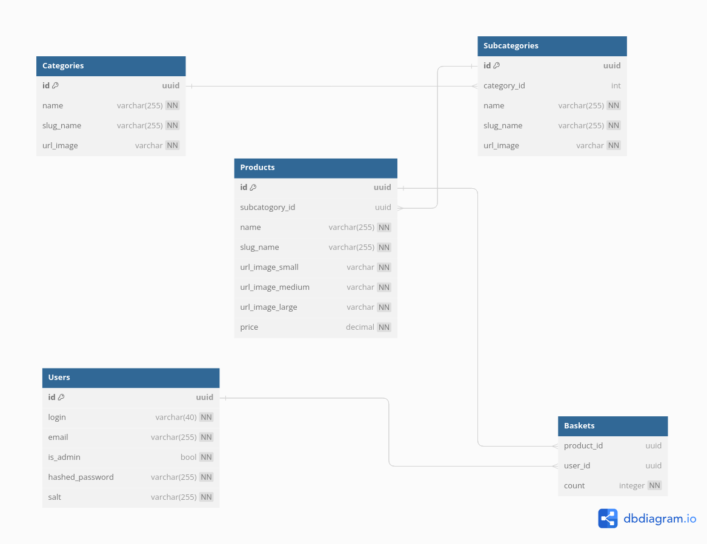

Marketplace
-----------
**Тестовое задание**

Схема БД:



**Установка**
1) Клонировать директорию
2) Создать виртуальное окружение:
```
python -m venv venv
```

3) Активировать виртуальное окружение

на windows:
```.\venv\scripts\activate``` 

на линукс:
```source venv/bin/activate```


4) Установить зависимости:
```
pip install -r requirements.txt
```
5) Указать переменные окружения админа, секретки, БД, тестовой БД в файле .env: 
(ADMIN_LOGIN, ADMIN_PASS, ADMIN_EMAIL, DB_HOST, DB_PORT, DB_USER, DB_PASS, DB_NAME, 
TEST_DB_HOST, TEST_DB_PORT, TEST_DB_USER, TEST_DB_PASS, TEST_DB_NAME,
SECRET_KEY)  Дополнительные переменные можно увидеть в src/config

6) Применить миграции
```commandline
alembic revision --autogenerate -m "init"
alembic upgrade heads
```

7) Запустить start_server.py
доки по /docs
админ панель: /admin (данные для входа те, что в .env)


9) Тесты (на данный момент недоделаны)
```commandline
    pytest
    или 
    python -m pytest 
```
